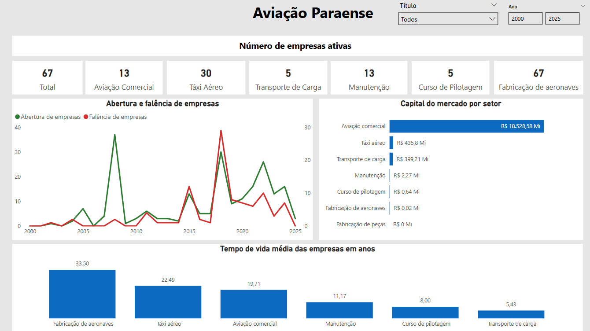

# Painel da Aviação Paraense

Este projeto tem como objetivo explorar, por meio de dados visuais, o histórico de empresas aéreas com cadastro no estado do Pará. Desenvolvido com **Power BI**, o painel apresenta informações como:

- Criação e falência de empresas aéreas
- Patrimônio por setor
- Quantidade de empresas por tipo de operação
- Tempo médio de atividade por setor

O painel busca analisar dados passados para identificar contextos e cenários que impulsionaram o setor aéreo paraense, bem como os fatores que contribuíram para sua retração ao longo dos anos.

---

## Funcionalidades

- Filtro interativo de linha do tempo
- Filtro por tipo de setor aéreo
- Scripts em Python para tratamento e filtragem de dados dos CNPJs disponibilizados pela Receita Federal do Brasil

---

## Atualização dos dados

Para atualizar os dados utilizados no painel:

1. Acesse o repositório de dados da Receita Federal:  
[Cadastro Nacional da Pessoa Jurídica (CNPJ)](https://dados.gov.br/dados/conjuntos-dados/cadastro-nacional-da-pessoa-juridica---cnpj)

2. Baixe os arquivos mais recentes de:
   - **Empresas**
   - **Estabelecimentos**

3. Salve os arquivos na pasta `base/`

4. Rode os scripts na pasta `filter/` nesta ordem:
   - `estabelecimentos.py`
   - `empresas.py`

---

## Painel

---

## Tecnologias utilizadas

- Power BI
- Python (pandas e duckdb)
- Dados públicos da Receita Federal do Brasil

